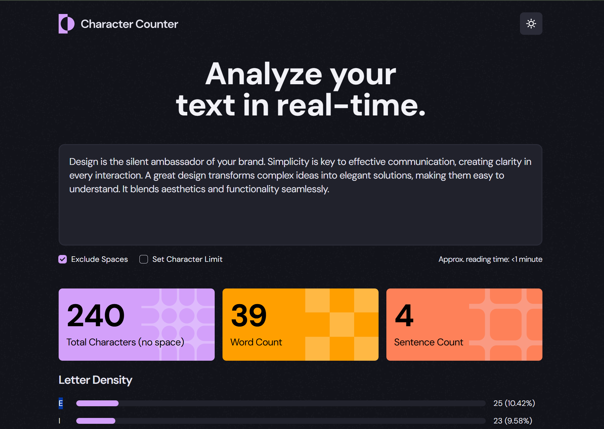

# 📝 Real-Time Character Counter & Text Analyzer

A fully responsive, real-time **Text Analyzer** web application built with **React & Tailwind CSS**.  
It helps you analyze your text and provides insights like:

- Character Count (with and without spaces)
- Word Count
- Sentence Count
- Estimated Reading Time
- Character Density Visualization
- Optional Character Limit Validation

---

## 🚀 Features

✅ Real-time text analysis  
✅ Dark & Light theme toggle  
✅ Exclude Spaces option  
✅ Set Character Limit with validation  
✅ Letter Density Bar Visualization  
✅ Clean UI & Fully Responsive  
✅ Deployed on GitHub Pages

---

## 🌐 Live Demo

👉 [Character Counter & Text Analyzer](https://19rohan97.github.io/character-counter/)

---

## 📂 Repository

🔗 [https://github.com/19Rohan97/character-counter](https://github.com/19Rohan97/character-counter)

---

## 🎯 Technologies Used

- React (CRA)
- Tailwind CSS
- React Hooks (`useState`, `useEffect`)
- JavaScript (ES6)

---

## 📸 Screenshots

|                     Light Mode                      |                     Dark Mode                     |
| :-------------------------------------------------: | :-----------------------------------------------: |
|  |  |

---

## ⚙️ How to Run Locally

```bash
git clone https://github.com/19Rohan97/character-counter.git
cd character-counter
npm install
npm start
```

**Production Build:**

```bash
npm run build
```

---

## 🧩 Folder Structure

```
src/
 ┣ components/
 ┃ ┣ Card.jsx
 ┃ ┣ CharLimitInput.jsx
 ┃ ┣ Checkbox.jsx
 ┃ ┣ DensityCard.jsx
 ┃ ┣ Header.jsx
 ┃ ┗ Textarea.jsx
 ┣ App.jsx
 ┗ index.css
```

---

## 🚀 What I Learned

- Managing **Derived State** in React
- Proper usage of **useEffect()**
- Dynamic and controlled components in React
- Handling dynamic styles and public assets
- Character limit error handling
- Real-time UI updates

---

## ⭐️ Future Improvements

- Add "Copy Text" & "Clear Text" buttons
- Add Export Result (CSV/JSON) option
- Add word frequency analysis
- Persist dark mode preference in localStorage
- Add sorting option in Letter Density

---

## 🙌 Author

**Rohan T George**  
📧 rohantgeorge05@gmail.com  
🌐 [www.rohantgeorge.ca](https://www.rohantgeorge.ca)
